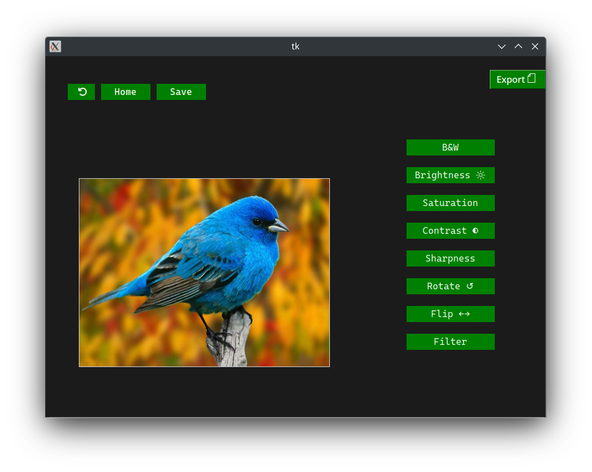

<div align="center">
  <h1 align="center">Image Editor</h1>
</div>

## Demo Images



## Tech Stack

- Python - Language
- Tkinter - GUI
- PIL - Image Manipulation

## Getting Started

### Prerequisites

Here's what you need to be able to run this project:

- Python 3

### 1. Clone the repository

```shell
git clone https://github.com/RickinShah/Image-Editor.git
cd Image-Editor
```

### 2. Install dependencies
```shell
pip install tkinter pil
```

### 3. Run the program
```shell
python3 main.py
```